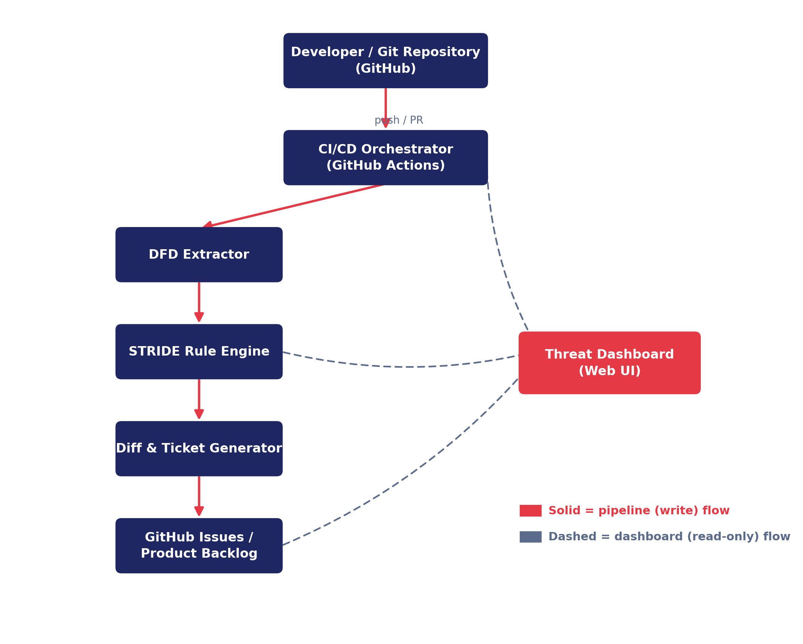
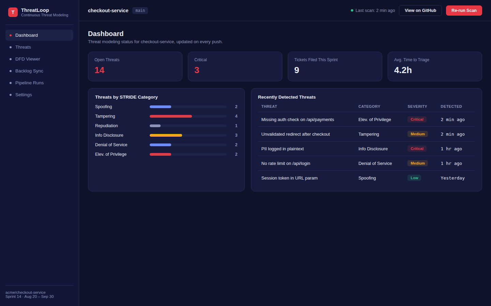
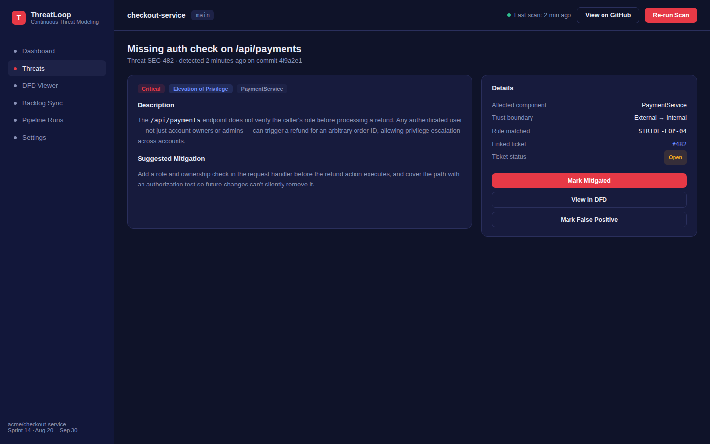
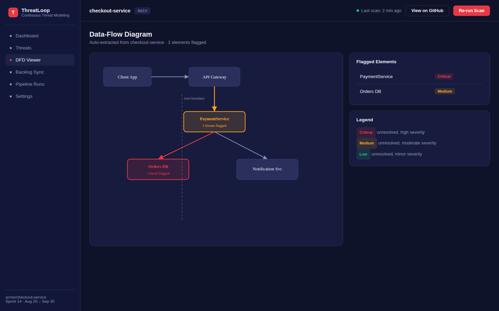
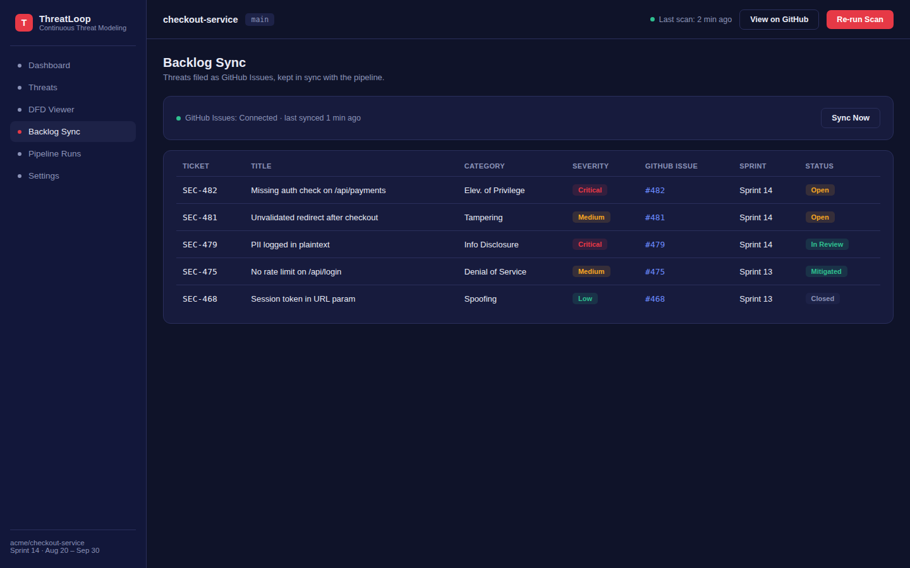
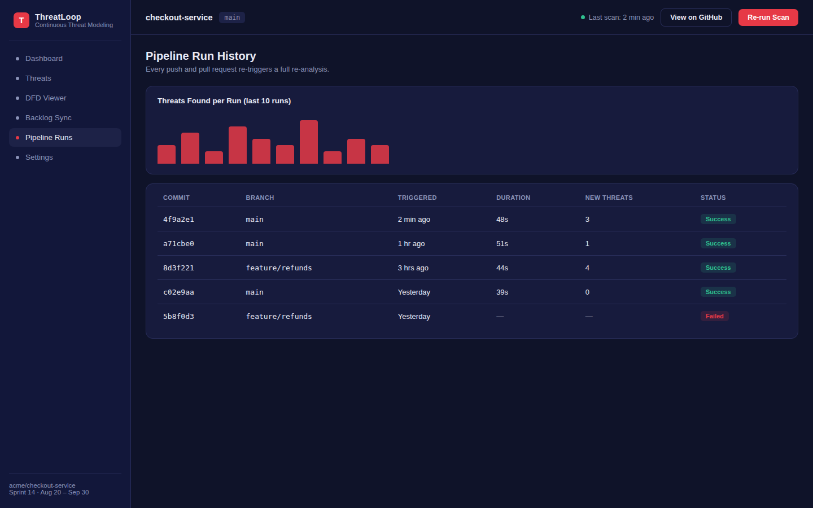
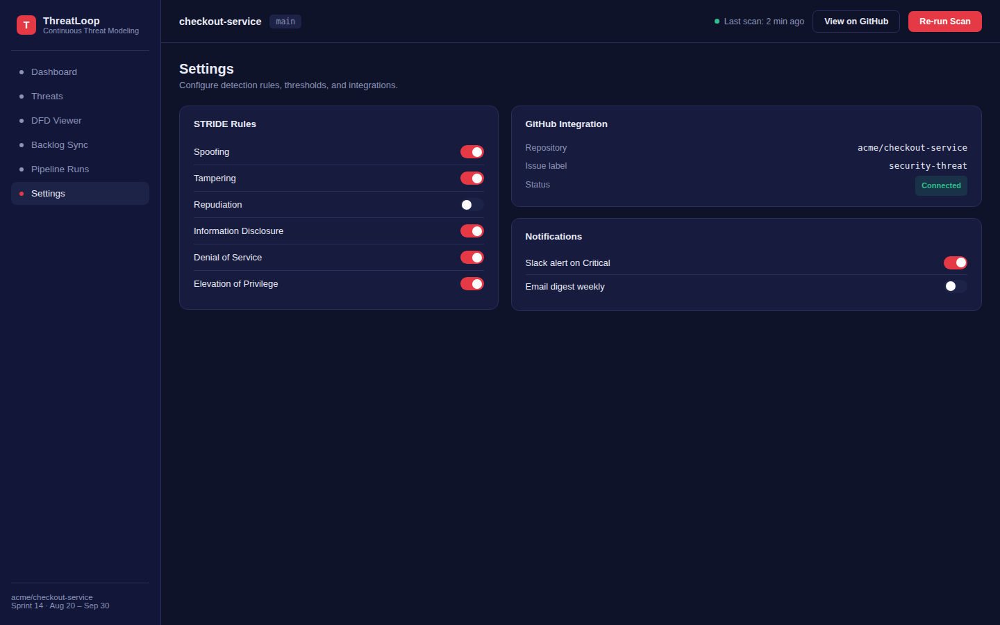

# ThreatLoop — Continuous Threat Modeling for Agile Sprints

> Automatically re-derives your project's threat model on every push or PR,
> files new threats as GitHub Issues, and exposes results through a
> read-only dashboard — with no paid infrastructure required.

[](https://github.com/SuryaRaikuni/Automated-Agile-threat-modeling/actions/workflows/threat-scan.yml)

---

## How It Works

1. Developer pushes a commit or opens a PR.
2. GitHub Actions triggers the ThreatLoop pipeline.
3. **DfdExtractor** parses the target codebase into a Data Flow Diagram.
4. **StrideRuleEngine** applies 6 STRIDE rules to every DFD element.
5. **ThreatDiffEngine** keeps only new/changed threats vs. the last run.
6. **TicketGenerator** files each new threat as a GitHub Issue.
7. **JsonReportWriter** writes `dashboard/data/*.json` with the full state.
8. The static dashboard reads those JSON files — it never writes back.

---

## Repository Structure

```
threatloop/
├── .github/
│   └── workflows/
│       └── threat-scan.yml          # CI/CD pipeline definition
├── pipeline/                        # Java pipeline source + fat JAR
│   ├── pom.xml
│   └── src/
│       ├── main/java/com/threatloop/pipeline/
│       │   ├── Main.java
│       │   ├── dfd/                 # DfdExtractor, DataFlowDiagram, DfdElement, DfdEdge
│       │   ├── rules/               # ThreatRule interface + 6 STRIDE implementations + StrideRuleEngine
│       │   ├── diff/                # ThreatDiffEngine
│       │   ├── ticketing/           # TicketGenerator, IssueTrackerClient, GitHubIssuesClient
│       │   ├── report/              # JsonReportWriter
│       │   └── model/               # Threat, Severity, StrideCategory
│       └── test/java/com/threatloop/pipeline/
│           ├── rules/               # StrideRuleEngineTest
│           └── ticketing/           # TicketGeneratorTest
├── sample-project/
│   └── checkout-service/            # Annotated Java project (pipeline scan target)
│       ├── pom.xml
│       └── src/main/java/com/example/checkout/
│           ├── annotations/
│           │   ├── ExternalEntity.java
│           │   ├── Process.java
│           │   └── DataStore.java
│           ├── PaymentGateway.java    # → SpoofingRule
│           ├── OrderRepository.java   # → InfoDisclosureRule
│           └── CheckoutController.java # → Repudiation + DoS + Tampering
├── dashboard/
│   ├── index.html                   # Screen 1: Dashboard Overview
│   ├── threat-detail.html           # Screen 2: Threat Detail
│   ├── dfd-viewer.html              # Screen 3: DFD Viewer
│   ├── backlog.html                 # Screen 4: Backlog Sync
│   ├── pipeline-runs.html           # Screen 5: Pipeline Run History
│   ├── settings.html                # Screen 6: Settings
│   ├── assets/
│   │   ├── theme.css
│   │   └── app.js
│   └── data/                        # JSON files written by pipeline, read by dashboard
│       ├── threats.json
│       ├── runs.json
│       └── backlog.json
├── docs/
│   └── design/                      # Architecture diagram + UI mockup screenshots
├── .gitignore
└── README.md
```

---

## Software Design

This project follows an **event-driven pipeline architecture** with a **read-only observability layer**: a push or PR triggers the CI/CD orchestrator, which runs DFD extraction → STRIDE rule evaluation → diffing → ticketing in sequence, while the ThreatLoop dashboard only reads from that pipeline's output and never writes back — so a dashboard issue can never block a CI run.

Key design choices:
- **STRIDE over PASTA** — STRIDE maps cleanly to automatable boolean checks on DFD attributes; PASTA requires manual risk scoring.
- **GitHub Issues as the backlog** — zero extra tooling; every team already uses GitHub.
- **DFD-as-code** — threat model lives in the source annotations, so it drifts with the code, not away from it.

### Architecture

- [Editable diagram (Draw.io)](docs/design/architecture-diagram.drawio)



---

### UI — ThreatLoop Dashboard

| Dashboard | Threat Detail | DFD Viewer |
|---|---|---|
|  |  |  |

| Backlog Sync | Pipeline Runs | Settings |
|---|---|---|
|  |  |  |

---

## Quick Start

### Run the pipeline locally

```bash
cd pipeline
mvn package -DskipTests
java -jar target/threatloop-pipeline-1.0-SNAPSHOT-jar-with-dependencies.jar \
  --project-root ../sample-project/checkout-service \
  --output-dir ../dashboard/data \
  --dry-run
```

### Run tests

```bash
cd pipeline && mvn test
```

### View the dashboard

Open `dashboard/index.html` in your browser. No server needed — it reads local JSON files.

---

## GitHub Actions Setup

`GITHUB_TOKEN` is automatically available to all Actions jobs — no extra secret needed.
The workflow runs on **every push and every PR** across all branches.

To restrict scanning to specific branches, edit the `on:` block in `.github/workflows/threat-scan.yml`.

---

## Design Principles

| Principle | Implementation |
|---|---|
| **Abstraction** | Every STRIDE category is a `ThreatRule` implementation. Adding a rule = adding one class, never editing `StrideRuleEngine`. |
| **Low coupling** | `DfdExtractor` and `StrideRuleEngine` communicate only via the `DataFlowDiagram` value object — neither references the other's internals. |
| **High cohesion** | `TicketGenerator` only files tickets; it receives `IssueTrackerClient` by constructor injection and does nothing else. |
| **Open/Closed** | New threat categories extend the system without modifying existing rules. |
| **Testability** | Each rule is a pure function over DFD nodes — no I/O, fully unit-testable with JUnit 5 + Mockito. |

---

## Sample Threats Detected on First Run

| Class | Annotation Attribute | STRIDE Category | Rule Triggered |
|---|---|---|---|
| `PaymentGateway` | `@ExternalEntity(auth="false")` | **S**poofing | `SpoofingRule` |
| `OrderRepository` | `@DataStore(encryptedAtRest="false")` | **I**nformation Disclosure | `InfoDisclosureRule` |
| `CheckoutController` | `@Process(logging="false")` | **R**epudiation | `RepudiationRule` |
| `CheckoutController` | `@Process(rateLimit="false")` | **D**enial of Service | `DenialOfServiceRule` |
| `CheckoutController` → `OrderRepository` | unencrypted inferred edge | **T**ampering | `TamperingRule` |

---

## License

MIT © Surya Raikuni
